# 计算物理导论-Himework 3: 常微分方程
## 结果及分析
### A. Kapitza摆
#### 1.求出系统的运动⽅程

以 $\theta$,$\dot{\theta}$为广义坐标和广义速度：
得到小球的动能：
$$T = \frac{1}{2}m[(-a \omega sin\omega t+l\dot{\theta}sin \theta)^2+(l \dot{\theta} cos \theta)^2]$$
$$T  = \frac{m}{2}[(l \dot{\theta} )^2+(a \omega sin(\omega t))^2-2a \omega l \dot{\theta}sin(\omega t)sin \theta]$$
势能(以x轴为势能零点)：
$$V = mg(a cos\omega t -lcos \theta)$$
体系的拉格朗日量为：
$$L = T-V$$
$$L = T - V =\frac{m}{2}[(l \dot{\theta} )^2+(a \omega sin(\omega t))^2-2a \omega l \dot{\theta}sin(\omega t)sin \theta] - mg  ( a cos(ωt) - l  cos(θ))$$
由拉格朗日方程：
$$\frac{d}{dt}\frac{\partial L}{\partial \dot{\theta}} - \frac{\partial L}{\partial \theta} = 0$$
化简得到：
$$l\ddot{\theta} = a \omega^2cos(\omega t )sin\theta -gsin(\theta)$$
不妨将$\dot{\theta}$记作$\Omega$，写成题目要求的形式：
$$\frac{d}{dt}\theta = \Omega$$

$$\frac{d}{dt}\Omega = \frac{a}{l} \omega^2cos(\omega t )sin\theta -\frac{g}{l} sin(\theta)$$

#### 2. 写出Runge-Kutta求解程序

在写出程序之前，思考以下问题：
- Q:任何⼀个别的ODE问题也可以抽象成$f(u,t,p)$吗？
- A:不一定，能写出$f(u,t,p)$形式的方程都是$\frac{d}{dt}u$在原方程中能够写出解析解的
- Q：（1）中显式写出动力系统的方程的意义：
- A：因为龙格库塔法只能解决一阶常微分方程，所以只有把$\ddot{\theta}$写成$\dot{\Omega}$的形式，以增加未知数个数的代价换取方程组由二阶将为一阶
- 此外，本程序使用使⽤精度较⾼的格式，例如课程介绍的````RK4 ````
得到求解的程序如下：
````python
def runge_kutta_4(f, u0: np.ndarray, t0: float, tf: float, dt: float, p: dict) -> np.ndarray:
    t = t0
    u = u0
    length = int((tf - t0) / dt) + 1
    trajectory = np.zeros((length, 3))
    time = 0
    while t < tf+dt:
        theta,omega_1 = u[0],u[1]
        trajectory[time,:] = np.array([t, theta, omega_1])
        k1 = dt * f(u, t, p)
        k2 = dt * f(u + 0.5 * k1, t + 0.5 * dt, p)
        k3 = dt * f(u + 0.5 * k2, t + 0.5 * dt, p)
        k4 = dt * f(u + k3, t + dt, p)
        u += (k1 + 2 * k2 + 2 * k3 + k4) / 6
        t += dt
        time += 1
    return trajectory
````

这个函数是在已知t时的值后求解t+dt时的值。

#### 3. 得到实验结果
取$l=m=g=1$,$a = 0.1$,$\omega = 5,10,20$，分别画出$θ(t)$和$ω(t)$的图像。得到结果如下：
$\omega = 5$:
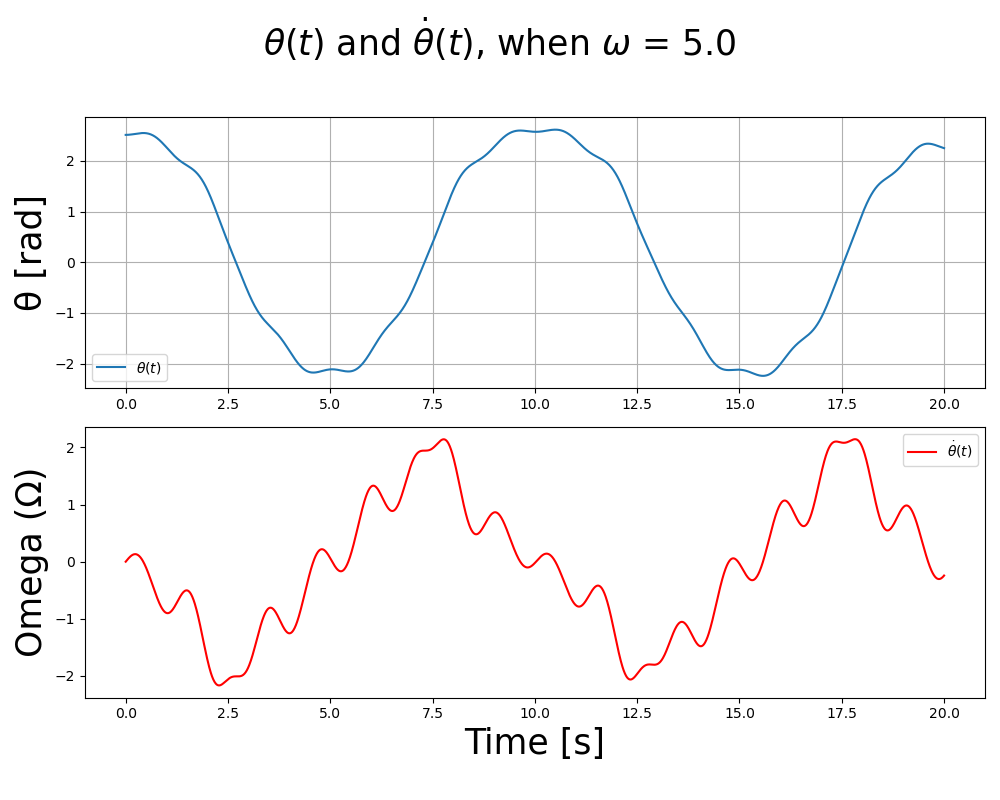
$\omega = 10$:
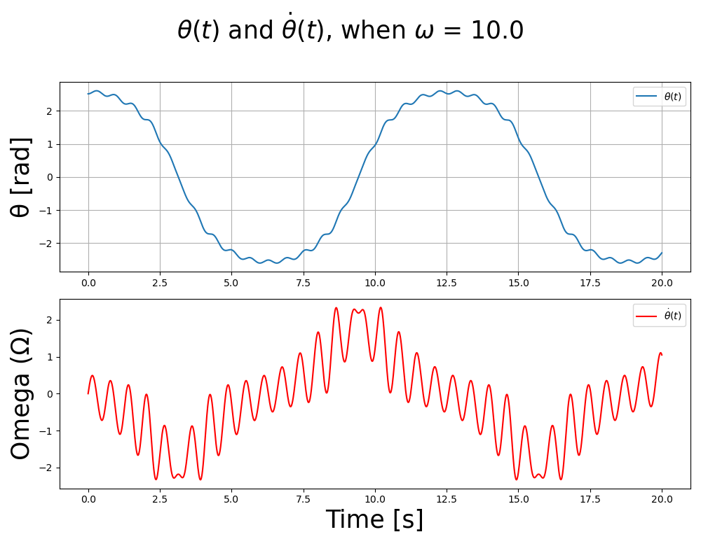
$\omega = 20$:
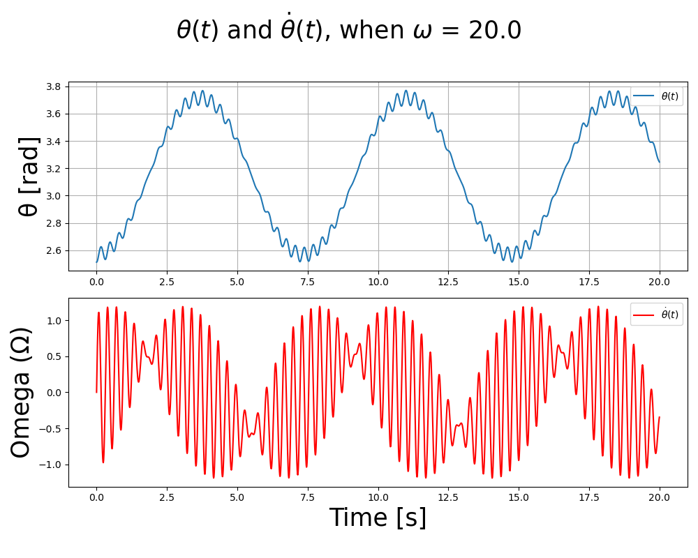
由上述结果我发现：
1. 当$\omega = 5$时，系统的振荡没有周期性
2. 当$\omega = 10$时，系统的振荡表现出了很强的周期性，并且是在下边周期性振荡
3. 当$\omega = 20$时，系统的振荡表现出了很强的周期性，并且是在上边不断振荡
   
为了进一步验证该发现，做出$ \theta$,$\omega$的相图如下：
$\omega = 5$:
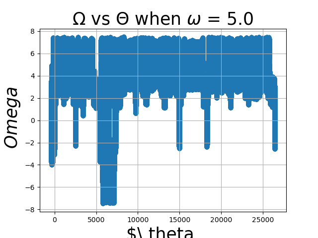
$\omega = 10$:
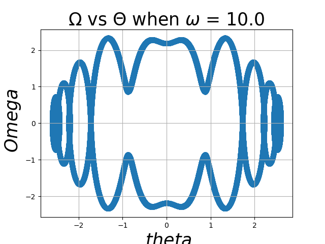
$\omega = 20$:
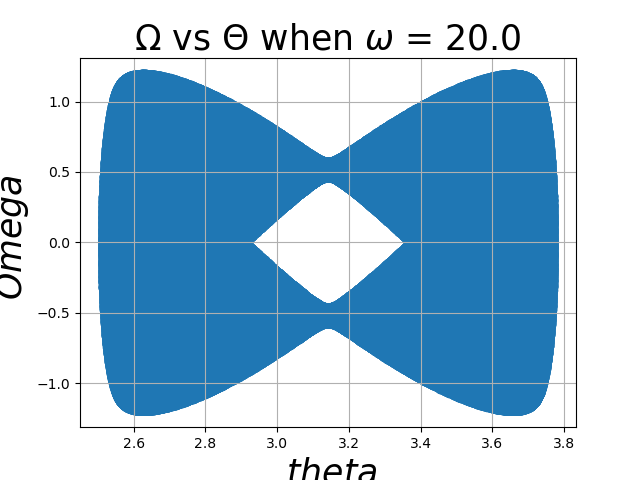


由以上相图可以发现，当$\omega = 5$时，相图不闭合，确实是一个混沌体系；当$\omega = 10，20$时，相图闭合，说明是周期体系。
特别有意思的是当$\omega = 20$时，小球可以在上方来回振荡。


#### 4.理论解释

以上$\omega = 20$时的现象可以用有效势能解释。有效是能是 (Effective Potential Energy) 是通过平均化方法 (Averaging Method)得到的，该方法用于处理包含快速振动或高频项的非线性动力学系统。在Kapitza摆的案例中，有效势能是通过考虑支点的高频振动对摆的运动影响的平均效果来得到的。

具体来说，Kapitza摆的运动方程为：

$$\ddot{\theta}+\left(\frac gL+\frac{A\omega^2}L\cos(\omega t)\right)\sin\theta=0$$

其中，$\frac{A\omega^2}L\cos(\omega t)$是一个高频项，其频率远大于摆的自然频率$\sqrt{\frac gL}$。为了简化这个方程，我们可以

使用平均化方法，将高频项的时间平均效果考虑进去。

平均化方法的基本思想是，对于一个快速变化的函数$f(t)$,其在一个周期$T$内的平均值可以表示为

$$\langle f(t)\rangle=\frac1T\int_0^Tf(t)\:dt$$


在Kapitza摆的案例中，我们考虑$\cos(\omega t)$ 的平均效果。由于$\cos(\omega t)$ 是一个周期函数，其在一个周期的平均值为零。但是，\( \cos^2(\omega t) \) 的平均值不为零，因为 \( \cos^2(\omega t) = \frac{1 + \cos(2\omega t)}{2} \)，而 \( \cos(2\omega t) \) 的平均值也为零，所以 \( \cos^2(\omega t) \) 的平均值为 \( \frac{1}{2} \)。

因此，我们可以将 \( \frac{A \omega^2}{L} \cos(\omega t) \sin \theta \) 的平均效果表示为 \( \frac{A \omega^2}{2L} \sin \theta \)。这样，Kapitza摆的运动方程可以近似为：

\[ \ddot{\theta} + \left( \frac{g}{L} + \frac{A \omega^2}{2L} \right) \sin \theta = 0 \]

这个方程可以看作是一个具有有效势能的单摆方程。有效势能 \( V_{\text{eff}}(\theta) \) 可以通过将上述方程与标准的单摆方程进行比较得到：

\[ V_{\text{eff}}(\theta) = -\left( \frac{g}{L} + \frac{A \omega^2}{2L} \right) \cos \theta \]

这个有效势能考虑了支点的高频振动对摆的运动的平均影响。当 \( A \omega^2 \) 足够大时，\( \frac{A \omega^2}{2L} \) 项会主导势能，使得 \( \theta = \pi \)（即摆锤在竖直向上位置）成为势能的最小值点，从而变得稳定。

综上所述，有效势能是通过平均化方法得到的，它考虑了高频振动对系统运动的平均影响。在Kapitza摆的案例中，有效势能的计算展示了高频振动如何改变系统的稳定性。

### B. 乒乓球

#### 1. 乒乓球的完整运动方程
由牛顿第二定律：
$$\ddot{y} = -g-\gamma\dot{y}$$
由此得到完整的运动方程：
$$ \frac{d}{dt}y=v $$
$$ \frac{d}{dt}v = -g-\gamma v$$
触碰球等效于：
$$ y =h(t) = Asin(\omega t)$$
此时球拍的速度为：$$\dot{h}(t) = A\omega cos(\omega t)$$
发生完全弹性碰撞，小球的速度发生突变：
$$v(t+dt)=2 A\omega cos(\omega t)-v(t)$$

#### 2.碰撞的处理
经过上述分析可以发现，通过判断````y=h(t)````这一条件可以判断是否发生了碰撞
但在实际数值计算时不能直接通过````y=h(t)````这一条件判断碰撞，因为解微分方程时利用的是离散的数值模拟，很容易发生实际碰撞了，但是由于数值离散导致漏失````y=h(t)````的条件，使得程序认为没有发生碰撞。
为了正确检测碰撞，应该判断球和球拍的位移是否有交叉，即$$(v_{now}-h_{now})(v_{before}-h_{before})<0$$
而如果碰撞，瞬时的位移不变，但是速度会发生突变
由此，得到碰撞的处理，用伪代码表示如下：
````python
def runge_kutta_4(f, u0: np.ndarray, t0: float, tf: float, dt: float, p: dict) -> np.ndarray:
    t = t0
    u = u0
    length = int((tf - t0) / dt) + 1
    trajectory = np.zeros((length, 3))
    time = 0
    while t < tf+dt:
        # 若碰撞，速度突变，否则直接带入龙格库塔法
        if (v_now-h_now)(v_before-h_before)<0:
            u[1] = 2*A*omega*cos(omega*t)-u[1]
        theta,omega_1 = u[0],u[1]
        trajectory[time,:] = np.array([t, theta, omega_1])
        k1 = dt * f(u, t, p)
        k2 = dt * f(u + 0.5 * k1, t + 0.5 * dt, p)
        k3 = dt * f(u + 0.5 * k2, t + 0.5 * dt, p)
        k4 = dt * f(u + k3, t + dt, p)
        u += (k1 + 2 * k2 + 2 * k3 + k4) / 6
        t += dt
        time += 1
    return trajectory
````

#### 3.结果展示
##### i.y0=0.3
在同一张图上展示0-10s,990-1000s的球和球拍的轨迹：


##### ii.改变y0
改变y0，得到结果如下：
y0=0.1:

y0=1：

y0=20:

y0=100:

y0=10000:


由上述图片可以发现，

##### iii.阻尼
将阻尼系数gamma=0，得到结果如下：
y0=0.1:
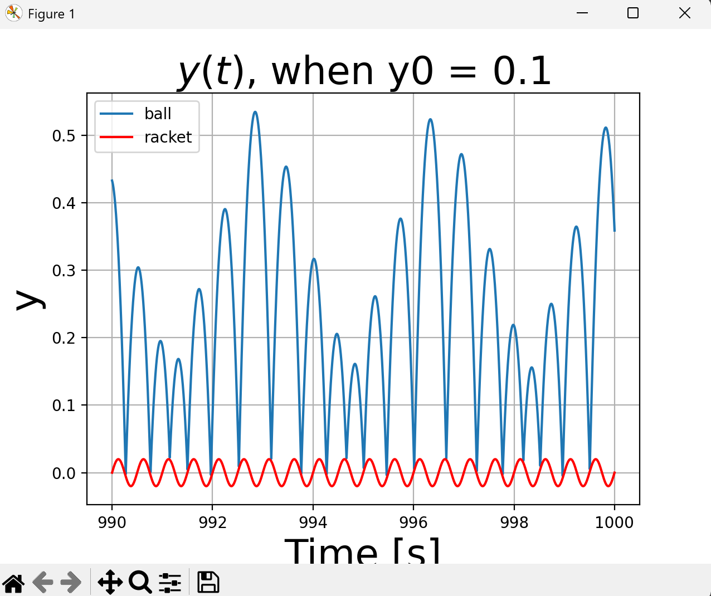
y0=0.2：
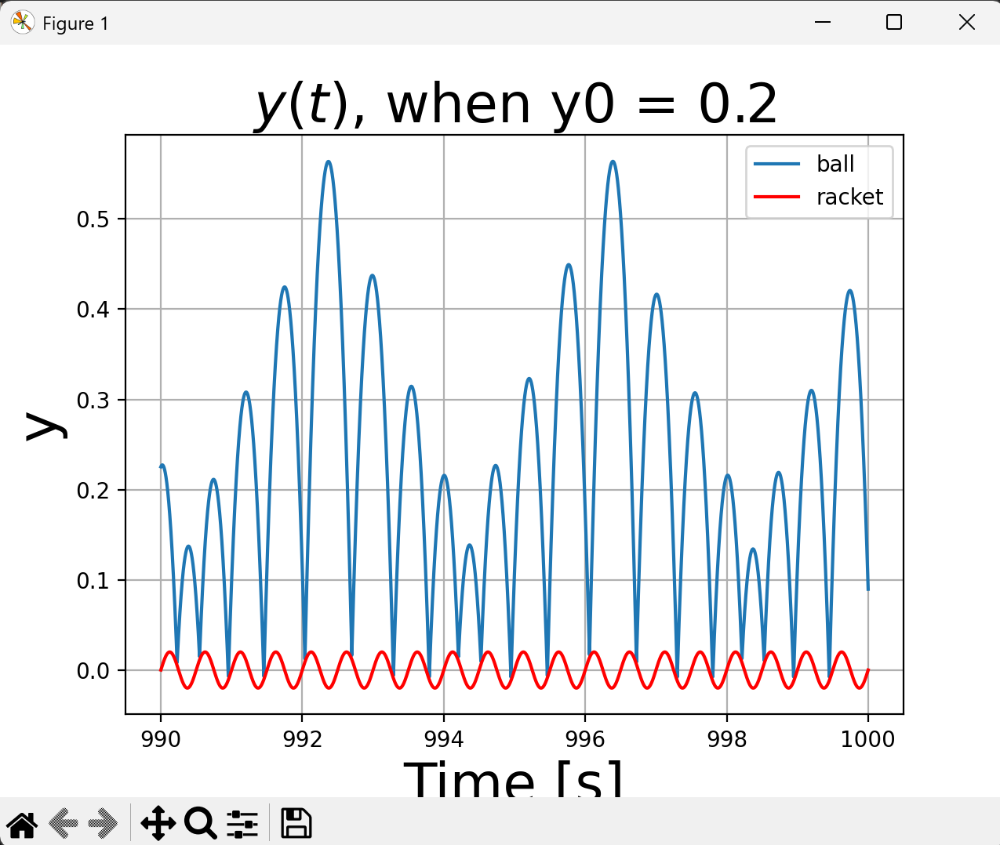
y0=0.3:
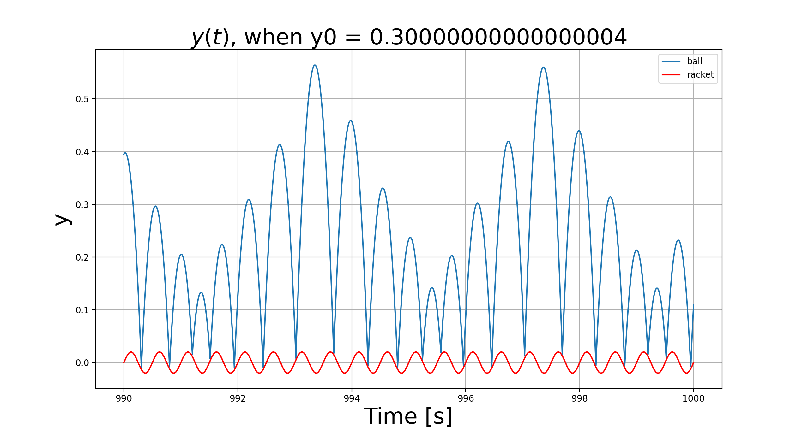
y0=0.4:

y0=0.5:
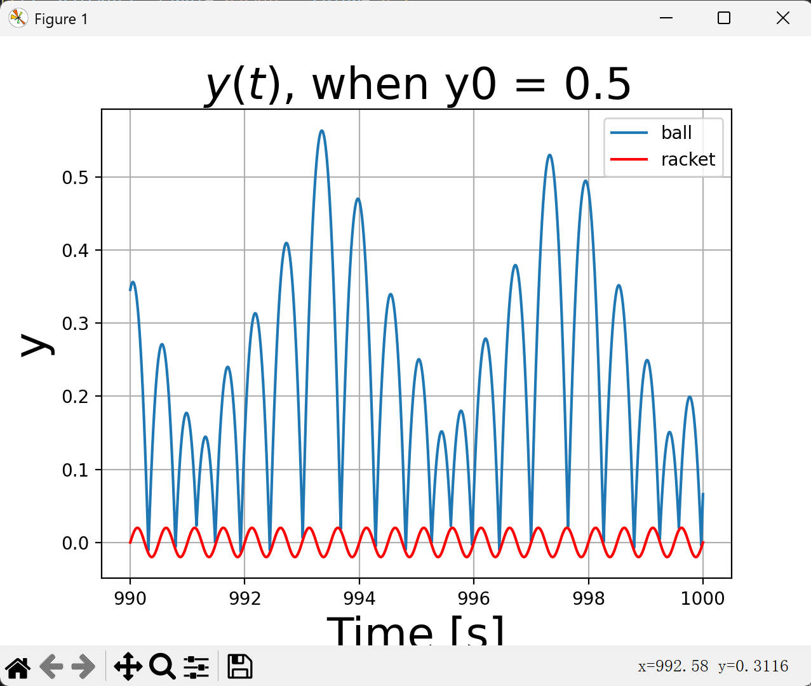
y0=0.6:
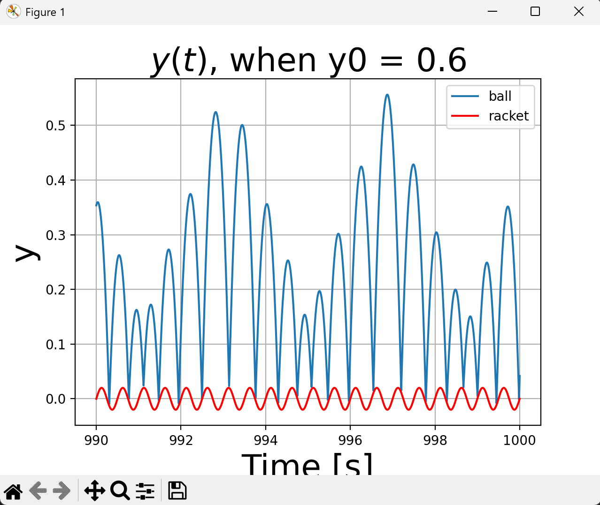

由以上图片可以发现：
没有阻尼的情况下，振荡的最大幅值不同，能达到的最大值不同。
阻尼在这个过程中起到了损耗能量，使得体系达到了某种周期性的作用。
#### 4.
在不发生碰撞时，求解关于$$\dot{y}$$的方程,解得$$\dot{y}=ce^{-\gamma t}-\frac{g}{\gamma}$$,由于在$t=0$时，$\dot{y}=0$，因此$\dot{y}(t)=\frac{g}{\gamma}e^{-\gamma t}-\frac{g}{\gamma}$。

积分得到$y(t)=y_0-\frac{g}{\gamma^2}e^{-\gamma t}-\frac{g}{\gamma}t+\frac{g}{\gamma^2}$。


## 附录
代码见：
git@github.com:jtzhao29/computational_physics_3.git
