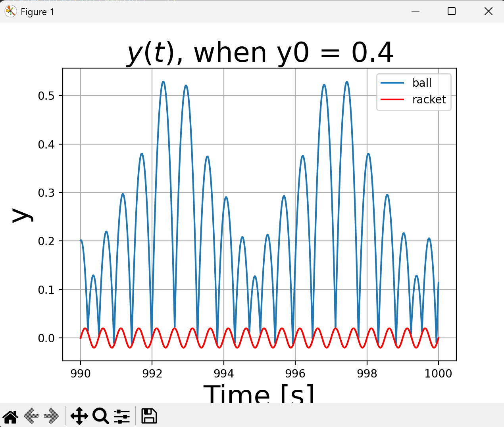

# 计算物理导论-Himework 3: 常微分方程
## 结果及分析
### A. Kapitza摆
#### 1.求出系统的运动⽅程

以 $\theta$,$\dot{\theta}$为广义坐标和广义速度：
得到小球的动能：
$$T = \frac{1}{2}m[(-a \omega sin\omega t+l\dot{\theta}sin \theta)^2+(l \dot{\theta} cos \theta)^2]$$
$$T  = \frac{m}{2}[(l \dot{\theta} )^2+(a \omega sin(\omega t))^2-2a \omega l \dot{\theta}sin(\omega t)sin \theta]$$
势能(以x轴为势能零点)：
$$V = mg(a cos\omega t -lcos \theta)$$
体系的拉格朗日量为：
$$L = T-V$$
$$L = T - V =\frac{m}{2}[(l \dot{\theta} )^2+(a \omega sin(\omega t))^2-2a \omega l \dot{\theta}sin(\omega t)sin \theta] - mg  ( a cos(ωt) - l  cos(θ))$$
由拉格朗日方程：
$$\frac{d}{dt}\frac{\partial L}{\partial \dot{\theta}} - \frac{\partial L}{\partial \theta} = 0$$
化简得到：
$$l\ddot{\theta} = a \omega^2cos(\omega t )sin\theta -gsin(\theta)$$
不妨将$\dot{\theta}$记作$\Omega$，写成题目要求的形式：
$$\frac{d}{dt}\theta = \Omega$$

$$\frac{d}{dt}\Omega = \frac{a}{l} \omega^2cos(\omega t )sin\theta -\frac{g}{l} sin(\theta)$$

#### 2. 写出Runge-Kutta求解程序

在写出程序之前，思考以下问题：
- Q:任何⼀个别的ODE问题也可以抽象成$f(u,t,p)$吗？
- A:不一定，能写出$f(u,t,p)$形式的方程都是$\frac{d}{dt}u$在原方程中能够写出解析解的
- Q：（1）中显式写出动力系统的方程的意义：
- A：因为龙格库塔法只能解决一阶常微分方程，所以只有把$\ddot{\theta}$写成$\dot{\Omega}$的形式，以增加未知数个数的代价换取方程组由二阶将为一阶
- 此外，本程序使用使⽤精度较⾼的格式，例如课程介绍的````RK4 ````
得到求解的程序如下：
````python
def runge_kutta_4(f, u0: np.ndarray, t0: float, tf: float, dt: float, p: dict) -> np.ndarray:
    t = t0
    u = u0
    length = int((tf - t0) / dt) + 1
    trajectory = np.zeros((length, 3))
    time = 0
    while t < tf+dt:
        theta,omega_1 = u[0],u[1]
        trajectory[time,:] = np.array([t, theta, omega_1])
        k1 = dt * f(u, t, p)
        k2 = dt * f(u + 0.5 * k1, t + 0.5 * dt, p)
        k3 = dt * f(u + 0.5 * k2, t + 0.5 * dt, p)
        k4 = dt * f(u + k3, t + dt, p)
        u += (k1 + 2 * k2 + 2 * k3 + k4) / 6
        t += dt
        time += 1
    return trajectory
````

这个函数是在已知t时的值后求解t+dt时的值。

#### 3. 得到实验结果
取$l=m=g=1$,$a = 0.1$,$\omega = 5,10,20$，分别画出$θ(t)$和$ω(t)$的图像。得到结果如下：
$\omega = 5$:

$\omega = 10$:

$\omega = 20$:

由上述结果我发现：
1. 当$\omega = 5$时，系统的振荡没有周期性
2. 当$\omega = 10$时，系统的振荡表现出了很强的周期性，并且是在下边周期性振荡
3. 当$\omega = 20$时，系统的振荡表现出了很强的周期性，并且是在上边不断振荡
   
为了进一步验证该发现，做出$ \theta$,$\omega$的相图如下：
$\omega = 5$:

$\omega = 10$:

$\omega = 20$:


由以上相图可以发现，当$\omega = 5$时，相图不闭合，确实是一个混沌体系；当$\omega = 10，20$时，相图闭合，说明是周期体系。
特别有意思的是当$\omega = 20$时，小球可以在上方来回振荡。


#### 4.理论解释

以上$\omega = 20$时的现象可以用有效势能解释。有效是能是 (Effective Potential Energy) 是通过平均化方法 (Averaging Method)得到的，在Kapitza摆中，往复电机对于小球的作用可以平均化为势能。

具体来说，Kapitza摆的运动方程为：

$$\ddot{\theta}+\left(\frac gL+\frac{A\omega^2}L\cos(\omega t)\right)\sin\theta=0$$

其中，$\frac{A\omega^2}L\cos(\omega t)$是一个高频项其频率$\omega$即为电机王府运动的频率。其频率远大于摆的自然频率$\sqrt{\frac gL}$。（前面$\omega$取较大值的时候的现象也能说明这一点）为了简化这个方程，我们可以使用平均化方法，将高频项的时间平均效果考虑进去。


在Kapitza摆中，我们考虑$\cos(\omega t)$ 的平均效果。 \( \cos^2(\omega t) \) 的平均值为 \( \frac{1}{2} \)。

因此，我们可以将 \( \frac{A \omega^2}{L} \cos(\omega t) \sin \theta \) 的平均效果表示为 \( \frac{A \omega^2}{2L} \sin \theta \)。
这样，Kapitza摆的运动方程可以近似为：

\[ \ddot{\theta} + \left( \frac{g}{L} + \frac{A \omega^2}{2L} \right) \sin \theta = 0 \]

这个方程可以看作是一个具有有效势能的单摆方程。有效势能 \( V_{\text{eff}}(\theta) \) 可以通过将上述方程与标准的单摆方程进行比较得到：

\[ V_{\text{eff}}(\theta) = -\left( \frac{g}{L} + \frac{A \omega^2}{2L} \right) \cos \theta \]

这个有效势能考虑了支点的高频振动对摆的运动的平均影响。当 \( A \omega^2 \) 足够大时，\( \frac{A \omega^2}{2L} \) 项会主导势能，使得 \( \theta = \pi \)（即摆锤在竖直向上位置）成为势能的最小值点，从而变得稳定。

### B. 乒乓球

#### 1. 乒乓球的完整运动方程
由牛顿第二定律：
$$\ddot{y} = -g-\gamma\dot{y}$$
由此得到完整的运动方程：
$$ \frac{d}{dt}y=v $$
$$ \frac{d}{dt}v = -g-\gamma v$$
触碰球等效于：
$$ y =h(t) = Asin(\omega t)$$
此时球拍的速度为：$$\dot{h}(t) = A\omega cos(\omega t)$$
发生完全弹性碰撞，小球的速度发生突变：
$$v(t+dt)=2 A\omega cos(\omega t)-v(t)$$

#### 2.碰撞的处理
经过上述分析可以发现，通过判断````y=h(t)````这一条件可以判断是否发生了碰撞
但在实际数值计算时不能直接通过````y=h(t)````这一条件判断碰撞，因为解微分方程时利用的是离散的数值模拟，很容易发生实际碰撞了，但是由于数值离散导致漏失````y=h(t)````的条件，使得程序认为没有发生碰撞。
为了正确检测碰撞，应该判断球和球拍的位移是否有交叉，即$$(v_{now}-h_{now})(v_{before}-h_{before})<0$$
而如果碰撞，瞬时的位移不变，但是速度会发生突变
由此，得到碰撞的处理，用伪代码表示如下：
````python
def runge_kutta_4(f, u0: np.ndarray, t0: float, tf: float, dt: float, p: dict) -> np.ndarray:
    t = t0
    u = u0
    length = int((tf - t0) / dt) + 1
    trajectory = np.zeros((length, 3))
    time = 0
    while t < tf+dt:
        # 若碰撞，速度突变，否则直接带入龙格库塔法
        if (v_now-h_now)(v_before-h_before)<0:
            u[1] = 2*A*omega*cos(omega*t)-u[1]
        theta,omega_1 = u[0],u[1]
        trajectory[time,:] = np.array([t, theta, omega_1])
        k1 = dt * f(u, t, p)
        k2 = dt * f(u + 0.5 * k1, t + 0.5 * dt, p)
        k3 = dt * f(u + 0.5 * k2, t + 0.5 * dt, p)
        k4 = dt * f(u + k3, t + dt, p)
        u += (k1 + 2 * k2 + 2 * k3 + k4) / 6
        t += dt
        time += 1
    return trajectory
````

#### 3.结果展示
##### i.y0=0.3
在同一张图上展示0-10s,990-1000s的球和球拍的轨迹：


##### ii.改变y0
改变y0，得到结果如下：
y0=0.1:


y0=1：


y0=20:

y0=100:


由上述轨迹图和相图可以发现：
1. 存在一种运动模式，是周期性的运动，运动频率等于球拍的振动频率
   尤其是在y0非常大的时候，在球拍的作用可以近似为地面，碰撞的位置近似为相等，碰撞后速度反相，有固定的周期
   在相图（速度-位置图）上球的运动轨迹是周期性的，轨迹在某一区域内不断重复。此时，轨迹不会交叉或回到以前的轨迹点，而是沿着一个闭合的轨道运行，显示出系统的稳定性。
2. 还存在另一种运动模式，是混沌体系，即使初始条件变化微小，系统的演化也会产生截然不同的轨迹。
   当参数y0达到某些临界值时，系统的行为变得不可预测且对初始条件敏感，导致系统进入混沌状态。
   相图不会回到原来的轨迹，呈现出无法预测的复杂模式

##### iii.阻尼
将阻尼系数gamma=0，得到结果如下：
y0=0.1:

y0=0.2：

y0=0.3:

y0=0.4:

y0=0.5:

y0=0.6:


由以上图片可以发现：
没有阻尼的情况下，振荡的最大幅值不同，能达到的最大值不同。在没有阻尼时，系统进入了一种复杂的混沌体系对于处置条件非常敏感，运动也不是周期性的。此外，虽然没有周期性，但是由于重力的作用，物体的运动依然被限制在了一定的空间范围内，没有发散。
阻尼在这个过程中起到了损耗能量的作用。在没有阻尼的情况下，系统中的能量无法耗散，这使得能量可以在各个自由度之间复杂地流动。这些复杂的能量流动与碰撞的非线性相互作用，可能是导致混沌行为的原因。

#### 4.
在不发生碰撞时，求解关于$\dot{y}$的方程,解得$$\dot{y}=ce^{-\gamma t}-\frac{g}{\gamma}$$,由于在$t=0$时，$\dot{y}=0$，因此$\dot{y}(t)=\frac{g}{\gamma}e^{-\gamma t}-\frac{g}{\gamma}$。

积分得到$y(t)=y_0-\frac{g}{\gamma^2}e^{-\gamma t}-\frac{g}{\gamma}t+\frac{g}{\gamma^2}$。

对于普适的情况：
$$\dot{y}=ce^{-\gamma t}-\frac{g}{\gamma}$$
$$y(t)=y_0-\frac{c}{\gamma}e^{-\gamma t}-\frac{g}{\gamma}t$$


不妨设在t0时发生碰撞时，$\dot{y}$发生突变：
$$ \dot{y} = 2A \omega cos\omega t_0 -c_1e^{-\gamma t_0}+\frac{g}{\gamma}$$
又由$$c_2-\frac{g}{\gamma}=2A \omega cos\omega t_0 -c_1e^{-\gamma t_0}+\frac{g}{\gamma}$$
得：
$$c_2=2A \omega cos\omega t_0 -c_1e^{-\gamma t_0}+\frac{2g}{\gamma}$$
上式给出了碰撞前后$\dot{y}$式子中常数c的变化。
由此在碰撞时刻就可以由碰撞的时刻精确地得出碰撞后$\dot{y}$的演化方程，积分后就可以得到y的精确求解。

总结如下：

1. 初始时刻已知y,v的初始值，由此得到$$\dot{y}=ce^{-\gamma t}-\frac{g}{\gamma}$$中的常数c
2. 代入常数，得到$\dot{y}$和y的演化方程
3. y =h(t)求解得到碰撞时刻
4. 将碰撞时刻$t_0$带入$$c_2=2A \omega cos\omega t_0 -c_1e^{-\gamma t_0}+\frac{2g}{\gamma}$$得到碰撞后$\dot{y}$和y的演化方程中的常数$c_2$，回到步骤2.

重复以上所示，就是求解y的轨迹的精确方法。 


## 附录
代码见：
git@github.com:jtzhao29/computational_physics_3.git
